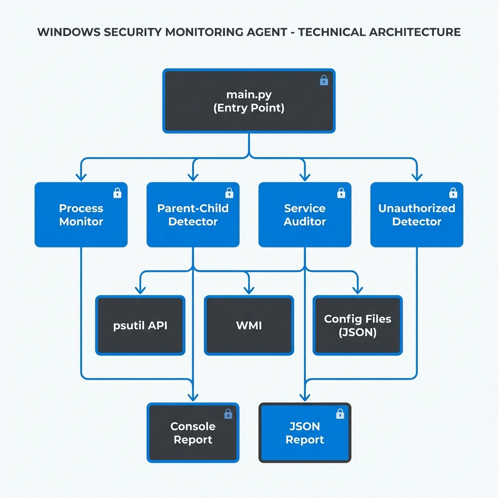

# 🛡️ Windows Service & Process Monitoring Agent

A Python-based security monitoring tool I built to detect malicious process behavior on Windows systems.

## 🎯 What This Does

This tool monitors your Windows system for suspicious activity by:

- **Detecting suspicious parent-child processes** - Like Word spawning PowerShell (common in macro attacks)
- **Auditing Windows services** - Finding services running from weird locations
- **Identifying unauthorized processes** - Using whitelist/blacklist approach

## 🚀 Quick Start

```bash
# Clone the repo
git clone https://github.com/Coder-Jay00/Windows_Monitoring_System.git
cd Windows_Monitoring_System

# Install dependencies
pip install -r requirements.txt

# Run a full scan
python main.py --full
```

## 📸 Sample Output

```
╔══════════════════════════════════════════════════════════════╗
║     WINDOWS SERVICE & PROCESS MONITORING AGENT               ║
╚══════════════════════════════════════════════════════════════╝

[1/3] Analyzing parent-child relationships...
[2/3] Auditing Windows services...
[3/3] Detecting unauthorized processes...

─── SUSPICIOUS SERVICES ───
[MEDIUM] Service: WSearch
    Reasons: Unquoted service path - potential hijacking vulnerability

─── UNAUTHORIZED PROCESSES ───
[MEDIUM] Process: unknown_app.exe
    Reasons: Process not in whitelist
```

## 📁 Project Structure

```
├── main.py                      # Main entry point
├── config/
│   ├── whitelist.json          # Allowed processes
│   └── blacklist.json          # Known bad processes
├── src/
│   ├── process_monitor.py      # Process enumeration
│   ├── parent_child_detector.py # Detects suspicious process chains
│   ├── service_auditor.py      # Windows service analysis
│   ├── unauthorized_detector.py # Whitelist/blacklist checking
│   └── report_generator.py     # Report output
├── logs/                        # Scan reports
└── docs/                        # Documentation & diagrams
```

## 🔧 Command Options

| Command | Description |
|---------|-------------|
| `python main.py --full` | Run complete system scan |
| `python main.py --quick` | Quick parent-child scan only |
| `python main.py --baseline` | Generate whitelist from current processes |

## 🛠️ Technologies Used

- **Python 3.11**
- **psutil** - Process enumeration
- **WMI** - Windows service queries
- **colorama** - Colored console output

## 📖 Detection Rules

The tool detects patterns like:
- Office apps (Word, Excel, Outlook) spawning cmd/powershell
- Browsers spawning command prompts
- Services running from temp/user folders
- Unquoted service paths (security vulnerability)

## 📊 Architecture



## 🔮 Future Plans

- [ ] Continuous monitoring mode
- [ ] Email alerts
- [ ] GUI interface
- [ ] Machine learning-based detection

## 📝 License

MIT License - feel free to use this for learning!

---

**Created by Jay Thakkar**  
*3rd Year B.E. Computer Science*
