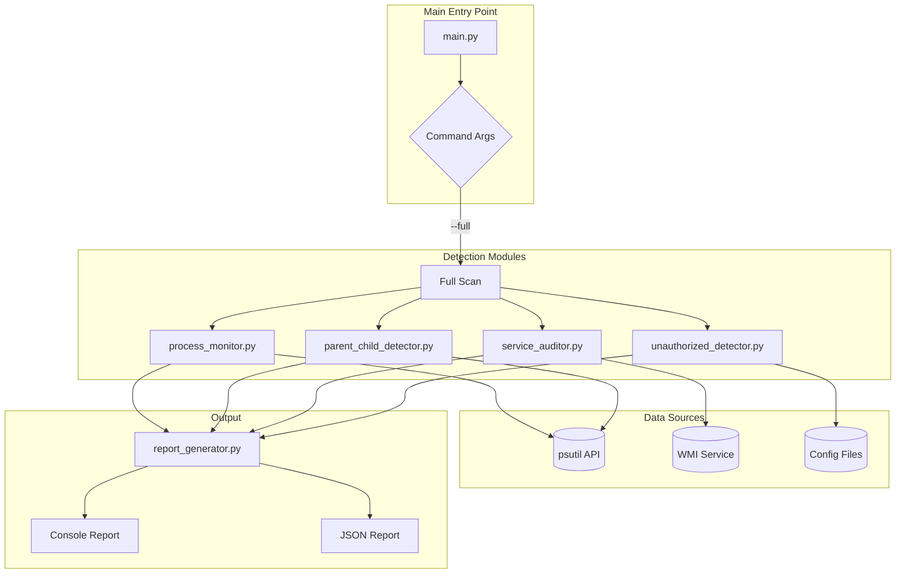
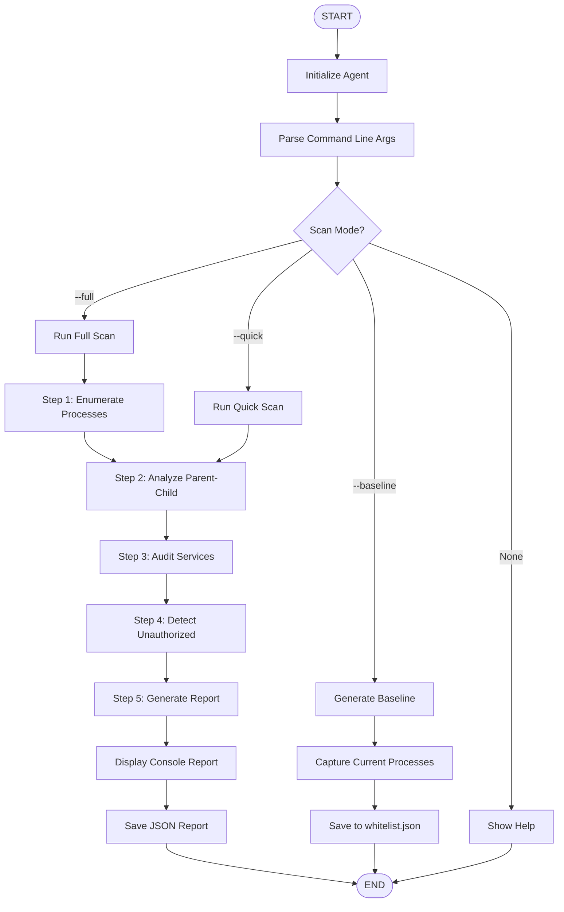
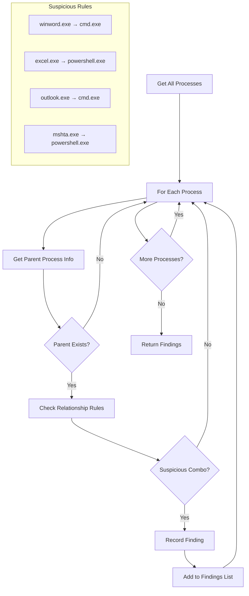
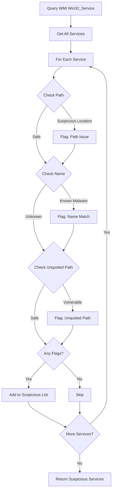
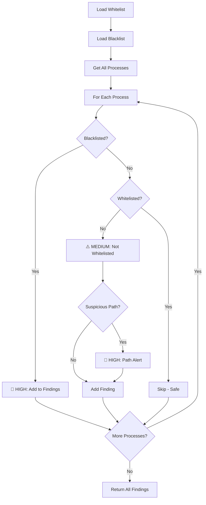
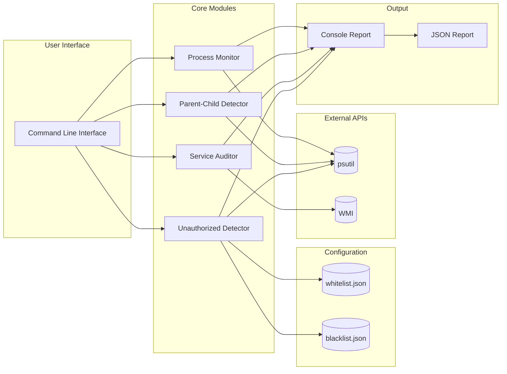

# Windows Monitoring Agent - Architecture & Flow Diagrams

## 1. System Architecture

---

## 2. Main Workflow Flowchart

---

## 3. Parent-Child Detection Flow

---

## 4. Service Audit Flow

---

## 5. Unauthorized Process Detection Flow

---

## 6. Component Diagram

---

## 7. Detection Rules Summary

| Detection Type | Parent Process | Child Process | Severity | Reason |
|---------------|----------------|---------------|----------|--------|
| Macro Attack | winword.exe | cmd.exe | HIGH | Office spawning shell |
| Macro Attack | excel.exe | powershell.exe | HIGH | Office spawning shell |
| Phishing | outlook.exe | powershell.exe | HIGH | Email client spawning shell |
| Browser Exploit | chrome.exe | cmd.exe | HIGH | Browser spawning shell |
| LOLBin Abuse | mshta.exe | powershell.exe | HIGH | Script host abuse |
| Service Exploit | svchost.exe | cmd.exe | HIGH | Service spawning shell |

---

## How to Use These Diagrams

### Option 1: Mermaid Live Editor
1. Go to https://mermaid.live
2. Copy any diagram code block
3. Paste and export as PNG/SVG

### Option 2: Draw.io
1. Go to https://draw.io
2. Create new diagram
3. Manually recreate based on these flows

### Option 3: VS Code Extension
1. Install "Markdown Preview Mermaid Support" extension
2. Open this file
3. Preview to see rendered diagrams
